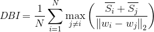

# 聚类算法评价指标——Davies-Bouldin指数（DBi）
source： https://blog.csdn.net/a841454735/article/details/80237257

戴维森堡丁指数（DBI），又称为分类适确性指标，是由大卫-戴维斯和唐纳德-Bouldin提出的一种评估
聚类算法优劣的指标。首先假设我们有m个时间序列，这些时间序列聚类为n个簇。m个时间序列设为输入矩阵X，
n个簇类设为N作为参数输入算法。DBI指数公式的含义时度量每个簇类最大相似度的均值。

DBI计算公式：

## 接下来时算法的具体计算步骤：
### 1，计算Si
DBI计算公式中首先定义了Si变量，Si计算的时类内数据到簇质心的平均距离，代表了簇类i中各时间序列的分散程度，
计算公式为：

其中Xj代表了代表簇类i中第j个数据点，也就是一个时间序列，Ai时簇类i的质心，Ti时簇类i中数据的个数，p在通常情况下取2，
这样就可以计算独立的数据点和质心的欧式距离（euclidean metric），当然在考察流形和高维数据的时候，欧氏距离
也许不是最佳的距离计算方式，但也是比较典型的了。

### 2，计算Mij
分子之和计算完后，需计算分母Mij，定义为簇类i与簇类j的距离，计算公式为：

ak,i代表簇类i质心点的第k个值，Mij就是簇类i与簇类j质心的距离。

### 3，计算Rij
计算了分子与分母后，DBI定义了一个衡量相似度的值Rij，计算公式为：

### 4，计算DBI
有了以上公式的基础，我们做一个基于簇类数n的n^2的嵌套循环，对每一个簇类i计算最大值Rij，记为Di，即

也即簇类i与其他类的最大相似度值，也就是取出最差结果。然后对所有类的最大相似度取均值就得到了DBI指数，计算公式为：

python代码实现见本项目同名py文件。